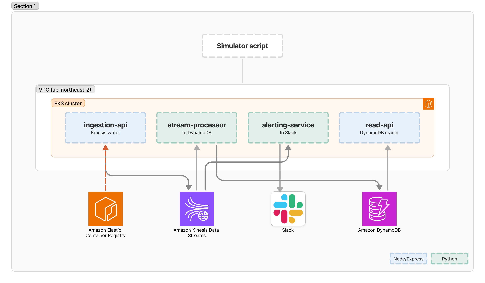

# iot-streaming-platform

IoT sensor data pipeline running on Kubernetes — devices push readings in, Kinesis moves them through, and four containerized services process, store, and alert on them. Built on AWS (ap-northeast-2) with Terraform.

## Why I built this

QuizLab (Project 1) was built entirely on managed, serverless AWS — Lambda, RDS, ElastiCache. This project picks up what QuizLab didn't touch: containers, Kubernetes, and self-managed orchestration.

VPC and EKS cluster boundaries are drawn as they actually are: Kinesis and DynamoDB sit outside the VPC, since nothing here uses VPC endpoints for them — pods reach both over their public endpoints through the NAT gateway.

## Architecture

  

## How it works

Four services sit in one EKS cluster, one namespace:

- **ingestion-api** (Node/Express) — receives sensor readings over HTTP and writes them to Kinesis
- **stream-processor** (Python) — polls the Kinesis stream and persists readings to DynamoDB
- **alerting-service** (Python) — polls Kinesis independently, checks readings against a threshold, and fires a Slack webhook when one is exceeded
- **read-api** (Node/Express) — read-only endpoint over DynamoDB for a dashboard frontend

API-facing services are Node, processing/decision services are Python. stream-processor and alerting-service each open their own Kinesis iterator rather than sharing a single reader — simpler than coordinating two consumers off one stream position, at the cost of each service re-reading the same records independently.

Devices themselves are simulated with a local script (`simulator.sh`) — no real hardware involved.

## Infrastructure

Terraform covers VPC, EKS (managed node group, t3.small, 1–3 nodes), Kinesis, DynamoDB, and IRSA roles — each service gets IAM permissions scoped to only what it needs instead of one shared node role. ECR lives in its own Terraform directory with separate state, so the compute layer (VPC, EKS) can be destroyed and rebuilt every session without rebuilding container images each time.

Kubernetes manifests live in a separate repo, [iot-streaming-platform-manifests](https://github.com/heeyeon-yang/iot-streaming-platform-manifests), managed with Kustomize and deployed by ArgoCD rather than applied by hand, including namespace creation.

## Deployment

A push to `main` that touches `services/**` triggers GitHub Actions, which builds and pushes the four images to ECR (authenticating via OIDC, no long-lived AWS keys in GitHub) and bumps the image tags in the manifests repo. ArgoCD watches that repo and reconciles the cluster on every change, with prune and selfHeal on so the cluster can't silently drift from what's committed. Full writeup in `docs/05-cicd-design.md`.

## Why some things are built the way they are

**No shared consumer coordination on Kinesis.** stream-processor and alerting-service both read from LATEST independently. During a `kubectl rollout restart`, the old and new pods briefly overlap and both grab fresh iterators, so alerting-service ended up firing duplicate Slack alerts for the same record. Fixed with in-memory dedup keyed on sequence number (last 500, deque + set) rather than a cross-process solution like a DynamoDB conditional write — a single in-memory cache is enough at this scale, and it doesn't need to survive a pod crash, since crashed pods don't overlap with anything else.

**Field naming doesn't match between services, on purpose.** ingestion-api writes camelCase fields (`deviceId`, `sensorType`) with an ISO timestamp string to Kinesis, since that's the natural shape for a Node/Express service. DynamoDB's schema is snake_case (`device_id`, `sensor_type`) with an epoch-second numeric range key, since that's a more normal DynamoDB convention. stream-processor does the translation in `process_record()` rather than forcing one service's naming onto the other.

## Stack

Terraform, AWS VPC/EKS/ECR/Kinesis/DynamoDB/IRSA, Node.js (Express), Python, Docker, Kustomize, ArgoCD, GitHub Actions (OIDC), Slack webhooks.
